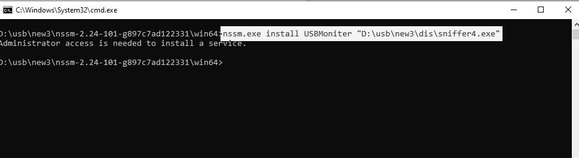
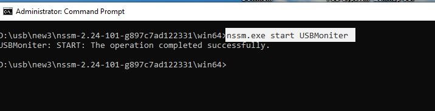
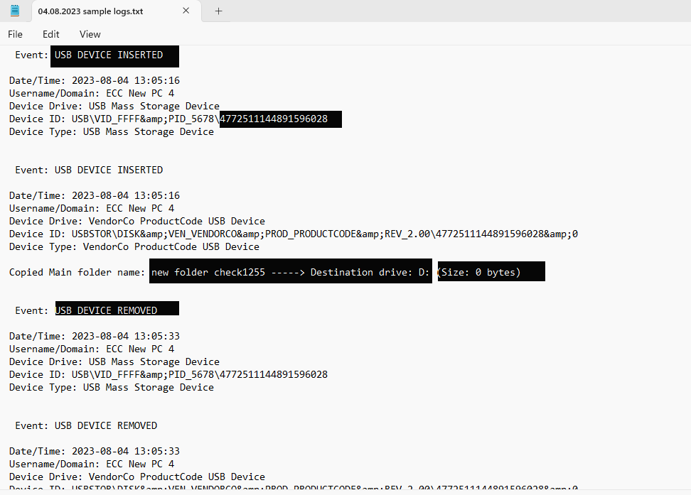

# USB Monitoring Service

The USB Monitoring Service is a Windows service program that logs USB events such as file transfers to and from USB devices, USB insertion, and USB removal. This README provides detailed instructions on how to install and use the service.

## Features
- Logs USB insertion and removal events.
- Logs files copied to and from USB devices.
- Records USB device information such as serial number and vendor name.

## Convert Python Code to Executable
You can use a tool like PyInstaller to convert your Python code into an executable. Here's a basic command to do this:

```sh
pyinstaller --onefile your_script.py
```

Replace `your_script.py` with the name of your Python script.

## Install the Service using NSSM
This tool NSSM we used to convert an executable file (.exe) into a Windows service. It allows you to install and manage the executable as a service, enabling it to run in the background without the need for user interaction.

1. **Download NSSM:** Download NSSM (Non-Sucking Service Manager) from the [NSSM website](https://nssm.cc/download).
2. **Extract NSSM:** Extract the NSSM ZIP file to a directory on your computer.
3. **Install the Service:**
   - Open a command prompt as an administrator and navigate to the directory where you extracted NSSM.
   - (Run as Administrator) the following command to install your executable as a service:
     ```
     nssm.exe install YourServiceName "C:\path\to\your\executable.exe"
     ```

Replace `YourServiceName` with the name you want to give your service and `C:\path\to\your\executable.exe` with the path to your executable.

Run the service 
```sh
nssm.exe start service_name
```


## Log File Description
The USB Monitoring Service logs events related to USB devices such as insertion, file copying to and from USB devices, and removal. Below is an example of the log file output which provides detailed information about each event:

- **Event Type**: Whether a USB device was inserted or removed, or if files were copied to the device.
- **Date/Time**: The exact date and time when the event occurred.
- **Username/Domain**: The username and domain of the user during the event.
- **Device Drive**: Description of the device involved in the event.
- **Device ID**: The unique identifier for the device.
- **Device Type**: The type of USB device (e.g., Mass Storage Device, Vendor-specific device).
- **Copied Main Folder Name and Destination Drive (if applicable)**: Details about the data transfer to the USB device including the main folder name and destination drive.

### Example Log File Output



*This example showcases typical entries you would find in the log file. Each entry provides insights into USB device interactions with the system, capturing critical details for security and monitoring purposes.*

## Log File Location and Naming Convention

The log files for the USB Monitoring Service are stored in the `usb_log` directory. Each log file is named with the current date (day-month-year format) when the log was created.

### Example Log File Path and Name

- Log File Directory: `usb_log`
- Log File Name: `04-08-2024.log`

This naming convention ensures that log files are organized chronologically, making it easy to track and analyze historical USB device activity.

## Support Development

If you've found this project useful and want to contribute to its ongoing development, please consider making a donation. Your support helps ensure the project remains maintained and receives updates.

**Pay What You Can:** Your donation, no matter the amount, is invaluable. It helps sustain the project, fuels future enhancements, and shows appreciation for the effort put into it.

Your generosity enables this project to grow and improve. Thank you for considering supporting this project!

### IBAN (International Bank Account Number)
```sh
PK31MEZN0008110108446179
```
<script src="https://platform.linkedin.com/badges/js/profile.js" async defer type="text/javascript"></script>
<div class="badge-base LI-profile-badge" data-locale="en_US" data-size="medium" data-theme="light" data-type="VERTICAL" data-vanity="saddambukhari" data-version="v1"><a class="badge-base__link LI-simple-link" href="https://pk.linkedin.com/in/saddambukhari?trk=profile-badge">Saddam Bukhari</a></div>
              